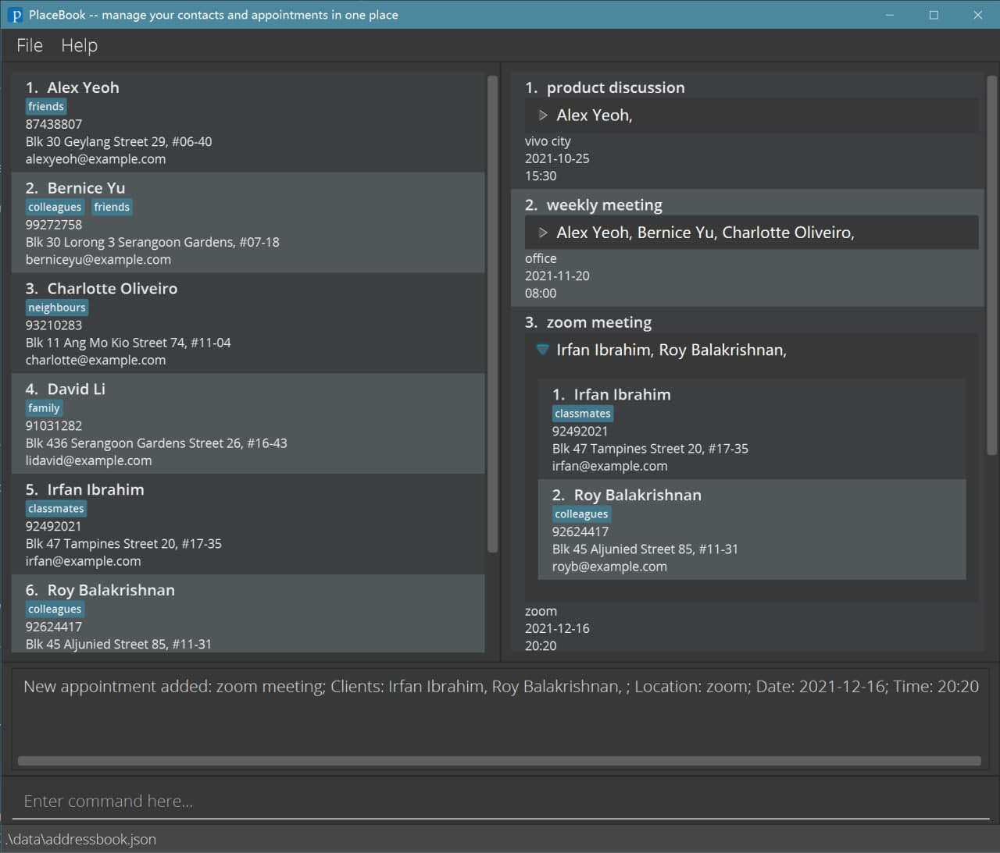

PlaceBook (PB) is a desktop app for managing contacts and appointments, optimized for use via a Command Line Interface (CLI) while still having the benefits of a Graphical User Interface (GUI). If you can type fast, PB can get your contact management tasks done faster than traditional GUI apps.

This project is based on the AddressBook-Level3 project created by the [SE-EDU initiative](https://se-education.org).
