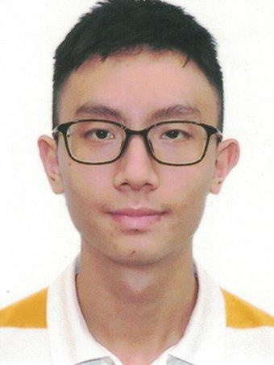
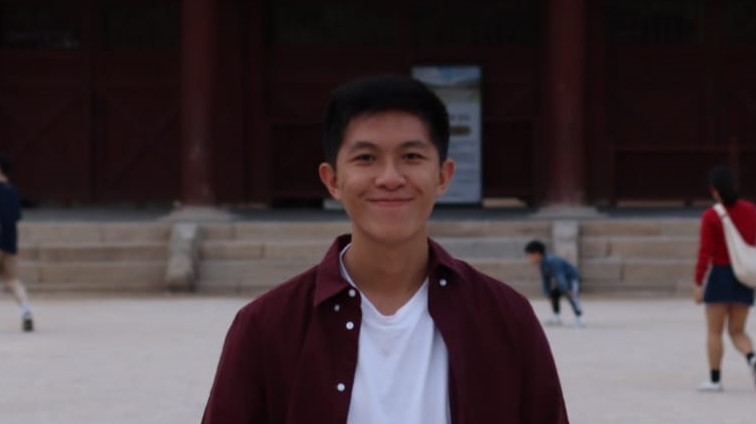
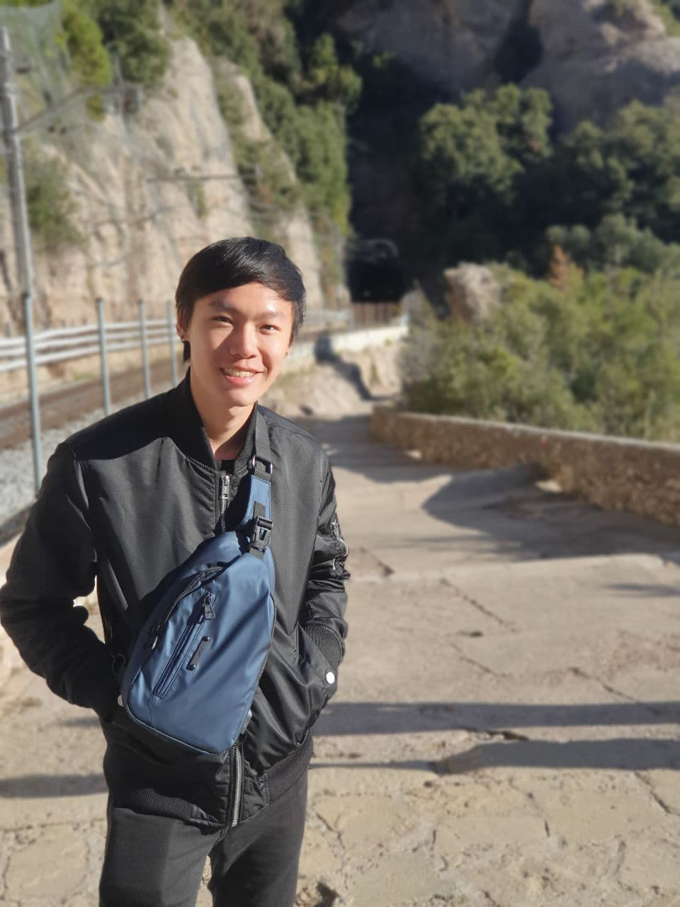

We are a team based in the [School of Computing, National University of Singapore](http://www.comp.nus.edu.sg).

You can reach us at the email `seer[at]comp.nus.edu.sg`

## Project team

### Chai Yew Meng

[[github](https://github.com/NecroWolf28)]
[[portfolio](team/johndoe.md)]

* Role: Developer
* Responsibilities: Proof-reading and Documentation

### Chen Yanyu

[[github](http://github.com/jYaleChen299)]
[[portfolio](team/johndoe.md)]

* Role: UI design and implementation
* Responsibilities: Merging PRs and implement UI.

### Li Lehao

[[github](https://github.com/Li-Lehao)] [[portfolio](team/johndoe.md)]

* Role: Developer
* Responsibilities: ..

### Nicholas

[[github](http://github.com/nwhloo)]
[[portfolio](team/johndoe.md)]

* Role: Developer
* Responsibilities: Creating Commands

### Teng Chiong

[[github](http://github.com/tchiong)]
[[portfolio](team/johndoe.md)]

* Role: Developer
* Responsibilities: Testing
